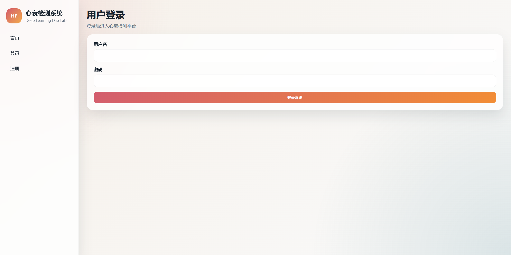
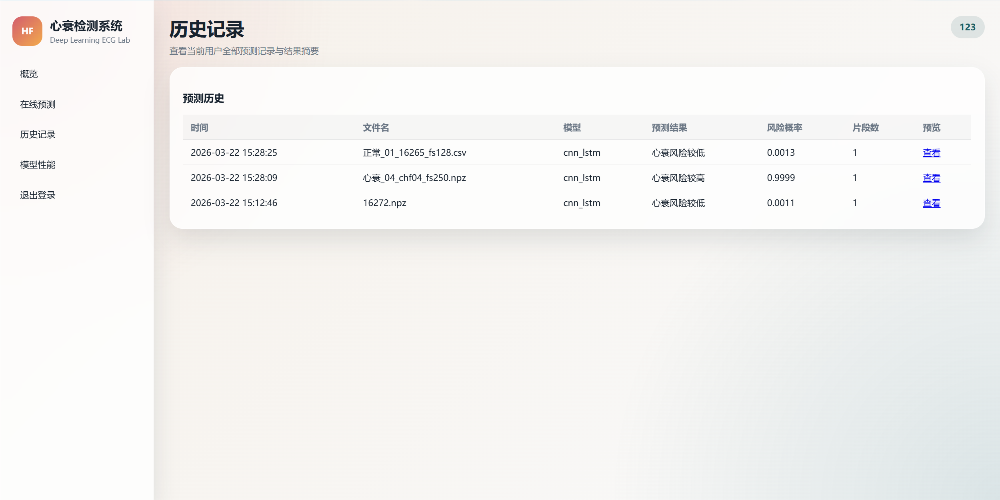
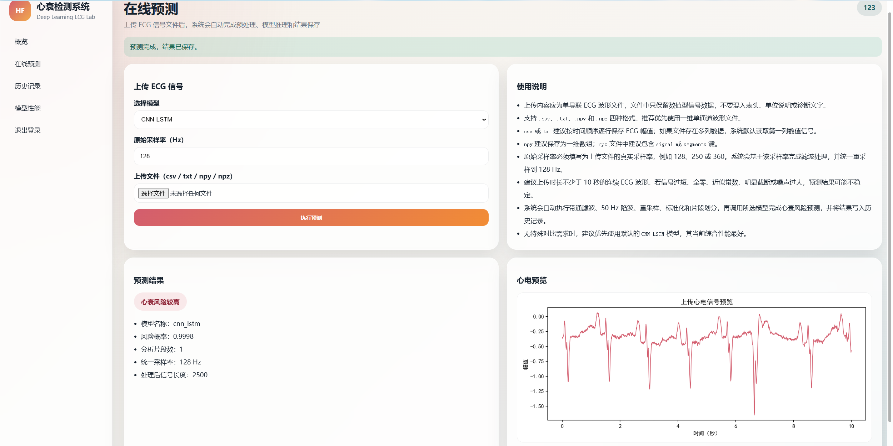
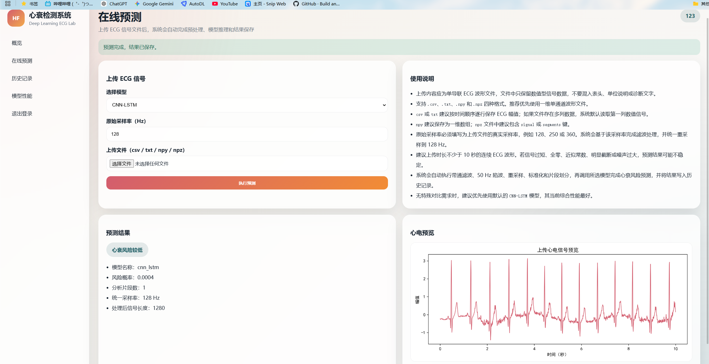
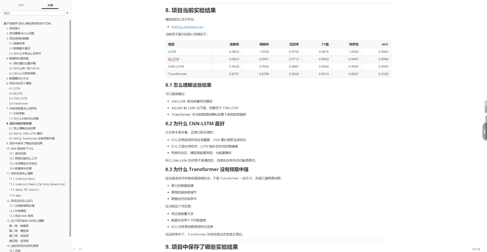

## 毕设源码仓库目录

[更多毕设源码、论文，供学弟学妹们选择 ~~>]()]

---

<div align="center">
  <h1 align="center">基于深度学习的心衰检测系统</h1>
  <p align="center"><strong>Deep Learning Based Heart Failure Detection System</strong></p>

  <p align="center">
    
    
    
  </p>

  <p align="center">QQ：604329062（获取完整毕设源码）</p>
  <p align="center">毕设之家QQ交流群：1095146693（进群获取毕设范文和免费资料）</p>

---

## 项目介绍

本项目围绕单导联 ECG 心电信号的心衰风险识别展开，包含完整的数据预处理、深度学习训练、结果可视化以及 Flask 在线预测系统。项目使用 `BIDMC Congestive Heart Failure Database` 与 `MIT-BIH Normal Sinus Rhythm Database` 构建实验数据，提供 LSTM、BiLSTM、CNN-LSTM、Transformer 四类模型的训练结果，并配套用户注册登录、在线上传预测、历史记录查询和模型性能展示页面，适合用于毕业设计展示、课程设计复现和二次开发。
| 项目维度 | 内容说明 |
| --- | --- |
| 项目类型 | 毕业设计 / 深度学习 / Web 系统 |
| 技术栈 | Python、Flask、PyTorch、NumPy、Pandas、Matplotlib、SQLite |
| 核心功能 | ECG 数据预处理、四类模型训练对比、在线预测、历史记录管理、性能结果展示 |
| 包含内容 | 源码、训练脚本、模型权重、实验结果图表、技术文档、演示视频 |
| 适用场景 | 毕业设计、课程设计、医学信号分析学习、深度学习项目复现 |


---

## 技术架构
```text
前端层：HTML / CSS / Jinja2 模板
后端层：Flask
数据层：NumPy / CSV / SQLite / WFDB 数据集文件
算法层：PyTorch（LSTM / BiLSTM / CNN-LSTM / Transformer）
部署方式：本地运行 / 开发环境演示 / 答辩展示环境
```

---

## 项目结构

```text
项目名称/
├── code/                 # 核心源码、训练脚本、预处理脚本、Web 启动脚本
├── app/                  # Web 模板、静态资源、SQLite 数据库、上传目录
├── data/                 # 原始数据、处理后数据、在线测试样本
├── model/                # 训练完成后的最佳模型权重文件
├── result/               # 实验输出、指标表、训练日志、可视化图表
├── 项目资料/              # 技术文档、演示视频、目录说明等交付材料
├── 素材/                  # README 展示截图、技术文档截图
└── requirements.txt      # Python 依赖清单
```

---

## 资源说明

本项目包含以下内容：

- 实验用的数据集
- 完整源码与可运行的 Flask 系统
- 完整的数据预处理与模型训练脚本
- 训练好的模型权重文件
- 实验指标表、对比图和训练过程图
- 技术文档与项目说明材料
- 项目演示视频

---

## 演示视频

- Bilibili：[Tensor正阳学长]()

---

## 项目展示图

### 首页展示


### 用户注册


### 用户登录



### 系统概览


### 在线预测上传页面


### 历史记录



### 模型性能展示


### 在线预测高风险结果



### 在线预测低风险结果



### 技术文档截图


### 技术文档实验结果截图


